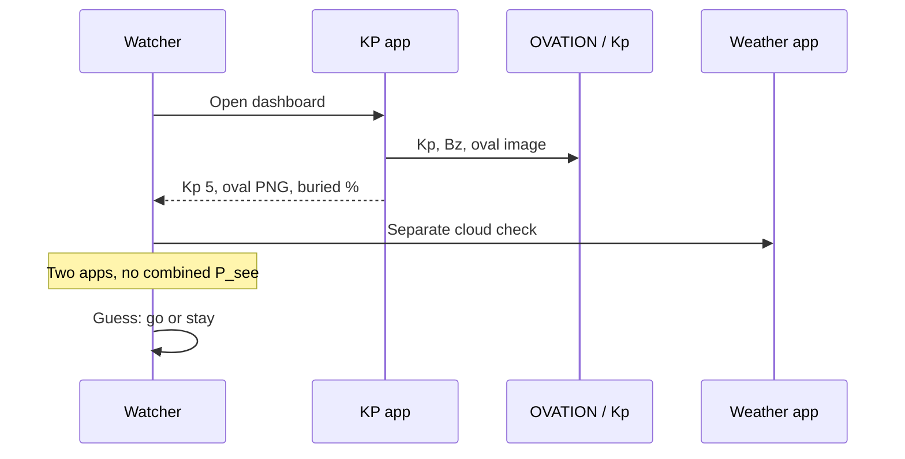

# Aurora — as-is (KP apps)

How a watcher decides tonight with My Aurora Forecast / Glendale / NOAA.

## Sequence

## Pain

- Product is **space weather** (Kp, Bz, substorm nT), not **will I see it from here**.
- Clouds and darkness are secondary or in another app.
- Map shows raw oval, not observed probability at a place.
- Nearby clearer town is a manual hunt.
