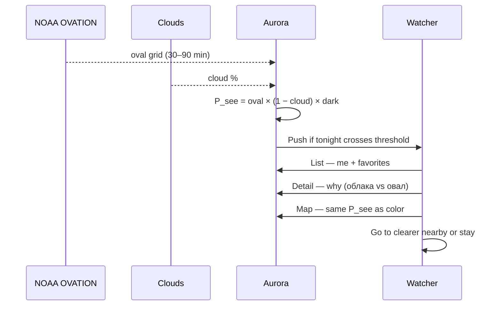

# Aurora — to-be (P_see)

One number at a saved place: oval × clear sky × darkness. List and map are the same number.

Prototype only — scripted cities, no live NOAA.

Related: [as-is today](./as-is.md)

## Sequence

## Happy path (numbered)

1. After dark, push: home P_see is low **because of clouds**, not because the oval is dead.
2. Simple list: my city + favorites, one percent each.
3. Detail splits the number: oval / clouds / darkness.
4. Map: tap the clearer nearby pin (Териберка).
5. Decision beat: go or replay.

## Not in this prototype

Live OVATION, own OvationPyme, photos, 3/27-day forecast, always-on GPS, top-5 search.
