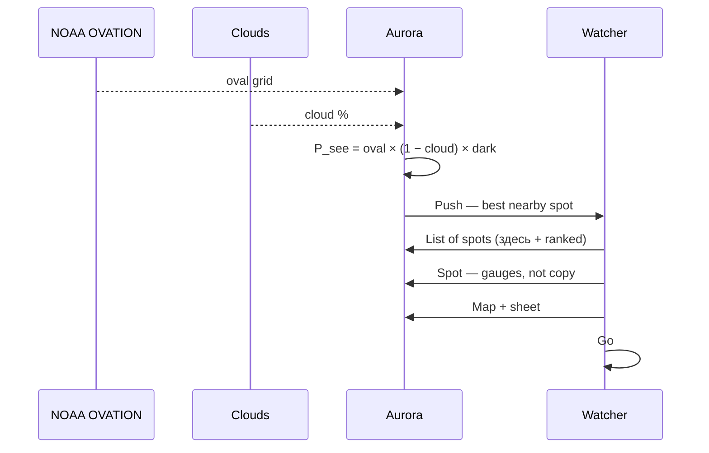

# Aurora — to-be (P_see)

One number on a **spot** (берег / плато / озеро), not a city. List and map share it.

Prototype only — scripted places, no live NOAA.

Related: [as-is today](./as-is.md)

## Sequence

## Happy path

1. Push: best spot (Берег) with % and km.
2. List of observation places. Здесь is a HUD, not a city row.
3. Spot screen: ring + three meters.
4. Map: % pins, same number, bottom sheet.
5. Go / replay.
