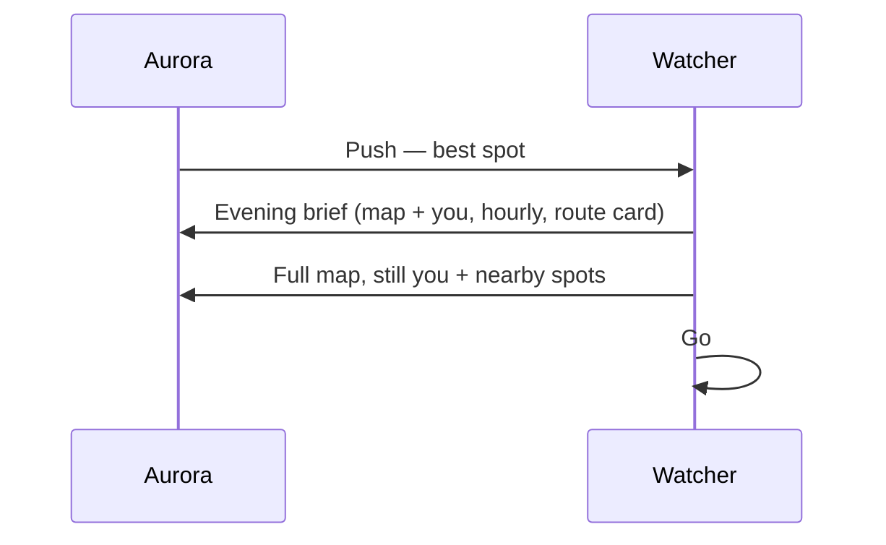

# Aurora — to-be (brief)

Now-brief: headline, **map with you on it**, hourly sky, one recommended spot.

Prototype only — scripted places, no live NOAA.

Related: [as-is today](./as-is.md)

## Sequence

## Happy path

1. Lock banner: spot + number.
2. Brief: map with current position, hourly clouds, «Ехать / Остаться».
3. Map: you (pulse) + spots as dots.
4. Go / replay.
