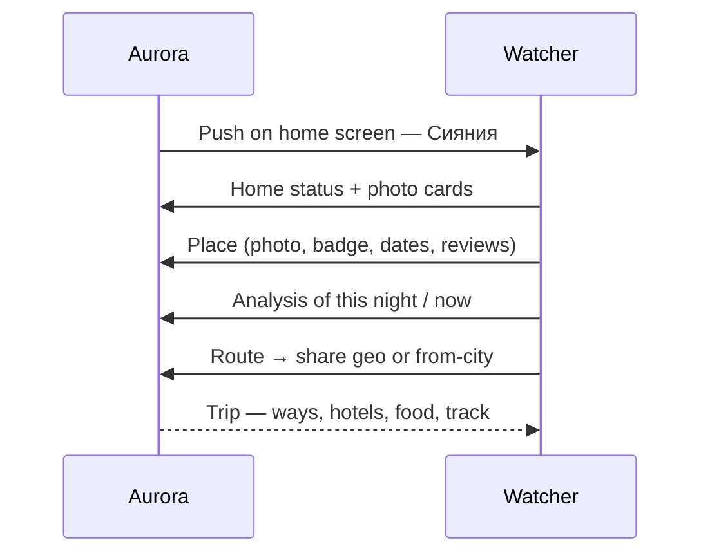

# Aurora — to-be (brief)

Job: inspire a trip, then show how to actually be there. Observation **places**, not cities. Number = **P_see** (oval × clarity × darkness). Scripted prototype, no live NOAA.

Geo is not asked on open. Only on **Маршрут**. Deny → «откуда». Everything after that origin.

Related: [as-is today](./as-is.md)

## Sequence

## Happy path

1. Lock: wallpaper + icons, banner «Сияния».
2. Home: nearest + most probable, photo cards of places.
3. Place: photo, P-score badge (`P 61%`), last-seen dates with year and score, map pin, reviews, Маршрут.
4. Analysis: badge or date → oval, clouds, darkness, history. Not a Kp dashboard.
5. Location gate, then trip from that point.
