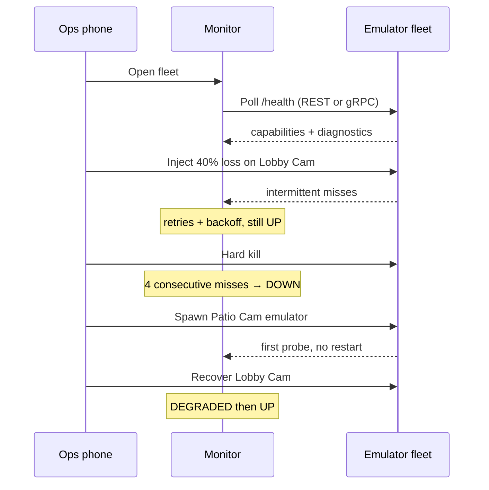

# Device monitor — booth fleet

Ops phone watches in-process emulators. Simulator owns fault injection. Monitor only paints status.

## Sequence

## Happy path

1. Fleet shows six emulators, all UP.
2. 40% loss on Lobby Cam — retries visible, status stays UP.
3. Hard kill — DOWN after four consecutive misses.
4. Add emulator (in-process, not a container).
5. Recover — DEGRADED, then UP.
