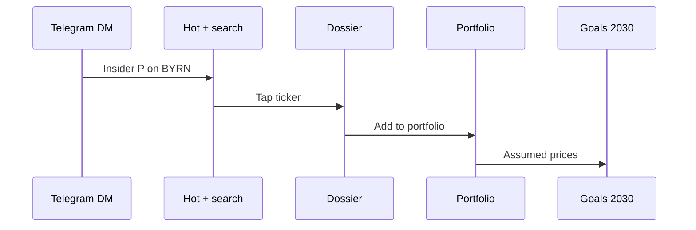

# Investing OS — mobile research loop

Telegram is the interrupt. Tap opens **Hot**, not the portfolio. Bottom nav: Home · Hot · Goals.

Related: `littlewhywhat/investing` `spec/concept.md`.

## Sequence

## Happy path

1. DM: insider bought BYRN.
2. Hot: same research list + search; tap BYRN.
3. Dossier cards: Form 4, memo, buyers, CEO. No Like/Skip.
4. Add → Home (economic P&L + positions, BYRN now in the list).
5. Goals: 2030 book at assumed prices. BYRN only if added.
