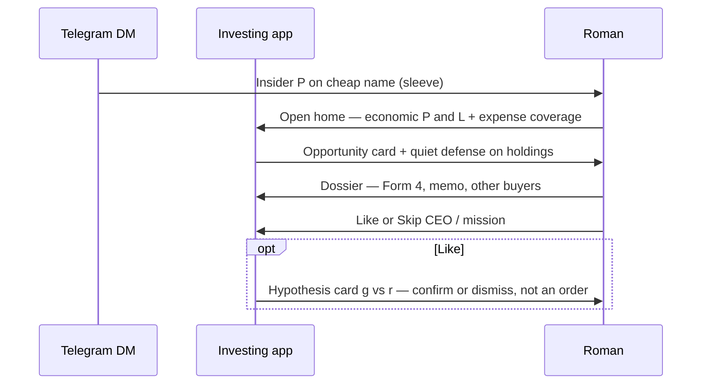

# Investing OS — mobile research loop

Telegram is the interrupt. Everything after is one app.

Related: `littlewhywhat/investing` `spec/concept.md` (Status, Goal, Opportunities, Defense, Hypothesis).

## Sequence

## Happy path

1. Daily DM: Form 4 **P** on a name that screens cheap vs own history.
2. Home answers Status (`equity + cashouts − deposits`) and Goal (coverage ratio), then the name.
3. One dossier scroll replaces OpenInsider → Fiscal → paste AI → eToro → 13F.
4. Human verdict. Hypothesis only after Like, on that name.

Defense is a badge on home, not a second story.
