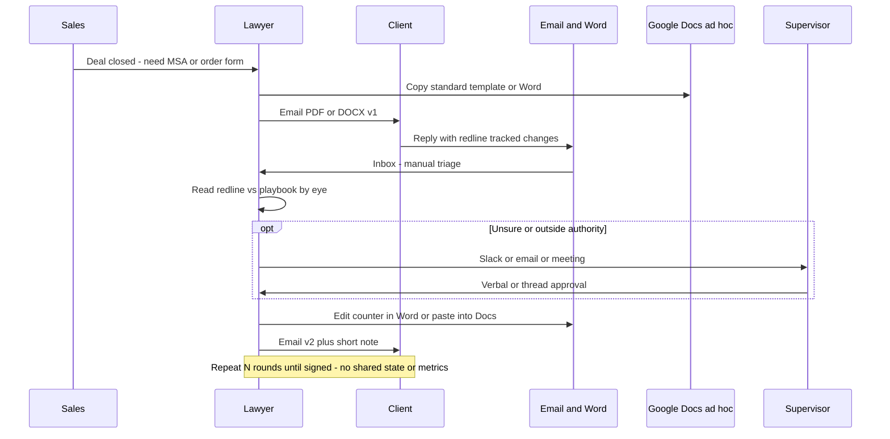

# Client redline — as-is (no system)

How the loop usually runs today after a lead closes, without Legal 360.

## Sequence

## Pain

- Each round is a stack of **manual** steps: pull the redline from email, eyeball it against the playbook, request approval when unsure, send the next file.
- No single source of truth - communication happens in email, slack, Google docs comments
- Requires a lawyer who preprocesses and provides context for Supervisor approval
