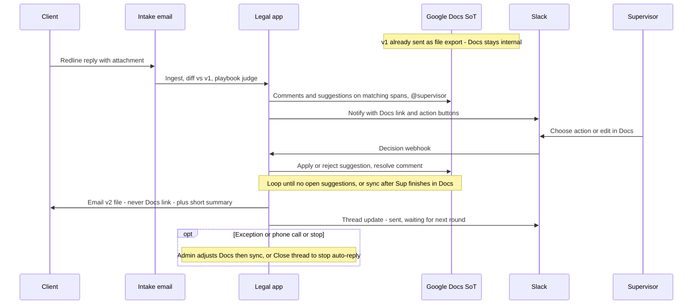

# Client redline — auto (Docs + Slack)

App ingests the client redline, annotates the internal Google Doc, notifies the supervisor in Slack; after decisions resolve, app exports and emails the client with a short summary.

In-app screens stay for **admin / exceptions** (phone call from client, stuck thread, force-close), not the happy path.

Related: [as-is today](./client-redline-as-is.md)

## Sequence

## Happy path (numbered)

1. Lead closed → we already sent our standard draft (file). Internal Docs copy is the working source of truth.
2. Client returns a **redline** → intake picks it up (no lawyer inbox step required).
3. App diffs against our draft, posts **comments / suggestions** on the Docs spans, @mentions the approver; Slack message with link + action buttons (and optional “prompt alternative here”).
4. Supervisor decides in Slack and/or Docs. App keeps Docs and its decision log in sync.
5. When the round is resolved, app **emails the client** the updated file + short summary (fully accepted vs accepted with our counters) and waits for the next reply.
6. Admin panel only for exceptions: manual tweak, re-sync from Docs, **close / stop email thread**.

## Roles of each system

| System | Role |
|---|---|
| Google Docs | Source of truth for internal draft + suggestion/comment state |
| Slack | Notification + primary decision UX for supervisor |
| Email | Only client-facing channel (send / receive files) |
| App | Ingest, judge vs playbook, Docs+Slack adapters, audit, auto-reply, admin kill-switch |
| Admin UI | Exceptions, force-close thread, inspect audit — not day-to-day review |
