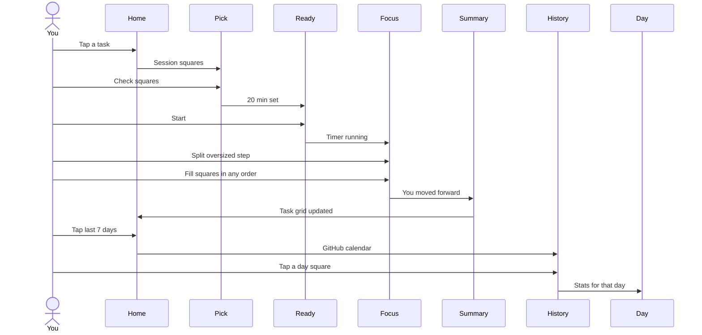

# Squares — focus loop

Anti-procrastination execution layer. Atomic unit is a **square** (one small action). Timer ≠ square.

Notion is import-only (out of this prototype). No guilt streaks. Copy: “You moved forward.”

## Happy path

1. Home — last-7-days GitHub strip; tasks as square grids. Tap a task (no Start Focus).
2. Choose squares — checkboxes / multiselect for this session.
3. Ready — pomodoro timer set, not running. Start.
4. Focus Mode — chosen squares, any order; Split if a step is too big.
5. Summary — +squares, progress before → after.
6. Home — same task, more squares filled. Tap the week strip → History.
7. History — GitHub calendar (one square per day). Tap a day → that day's stats.

