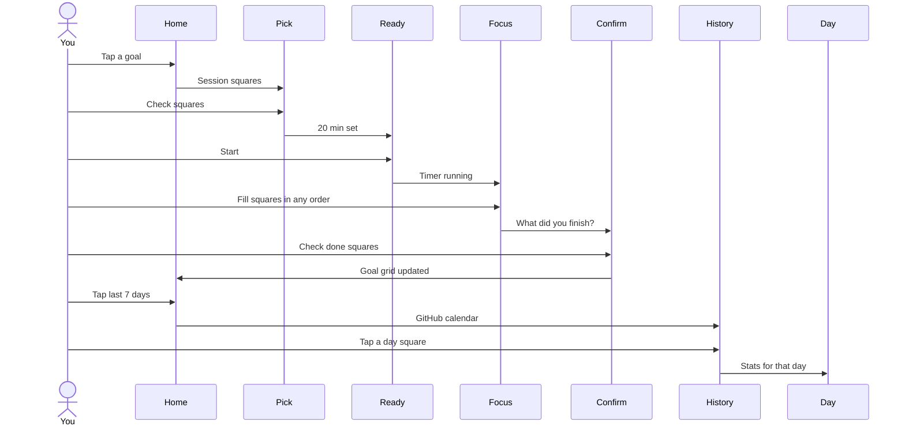

# Squares — focus loop

Anti-procrastination execution layer. Atomic unit is a **square** (one small action).

Notion is import-only (out of this prototype). No guilt streaks. Copy: “You moved forward.”

## Happy path

1. Home — last-7-days GitHub strip; goals as square grids. Tap a goal (no Start Focus).
2. Choose squares — checkboxes / multiselect for this session.
3. Ready — pomodoro timer set, not running. Start.
4. Focus Mode — chosen squares, any order. End session when you want.
5. Confirm — check what you finished (not every square). Confirm.
6. Home — same goal, more squares filled. Tap the week strip → History.
7. History — GitHub calendar (one square per day). Tap a day → that day's stats.

