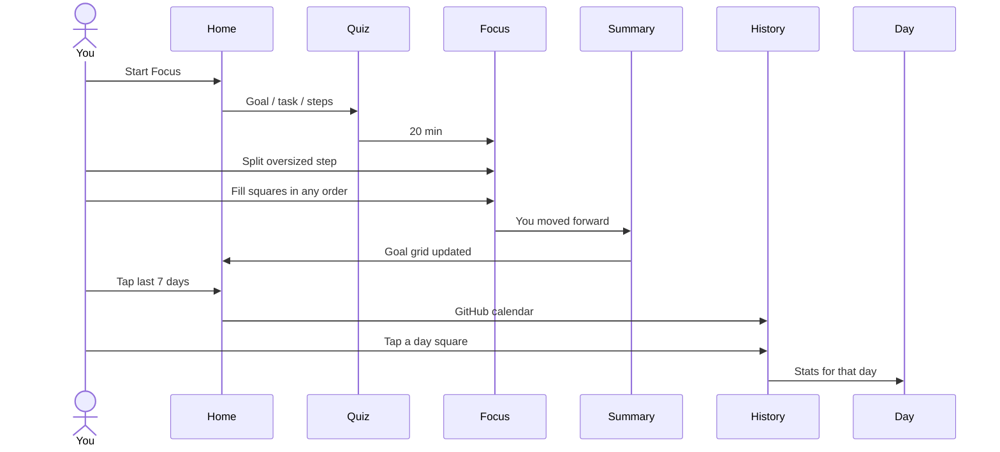

# Squares — focus loop

Anti-procrastination execution layer. Atomic unit is a **square** (one small action). Timer ≠ square.

Notion is import-only (out of this prototype). No guilt streaks. Copy: “You moved forward.”

## Happy path

1. Home — last-7-days GitHub strip on top; goals as small square grids; Start Focus.
2. Quiz — Goal → Task → session squares (mark too-big ones).
3. Focus Mode — list of chosen squares, any order; Split if a step is too big.
4. Summary — +squares, progress before → after.
5. Home — same goal, more squares filled. Tap the week strip → History.
6. History — GitHub calendar (one square per day). Tap a day → that day's stats.

