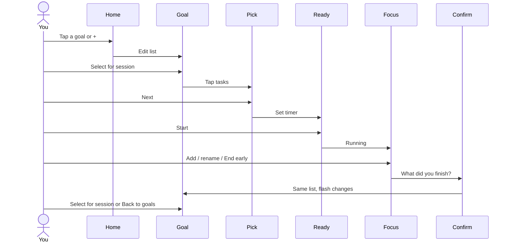

# Squares — focus loop

Anti-procrastination execution layer. Atomic unit is a **square** (one small action).

Notion is import-only (out of this prototype). No guilt streaks. Copy: “You moved forward.”

## Happy path

1. Home — last-7-days GitHub strip; goals; `+` under the list (name modal). Tap a goal.
2. Goal — edit the Keep-style list. Checkbox = done. Empty new goal: tap List item to seed tasks. Select for session.
3. Pick — tap tasks for this session. Next.
4. Ready — set timer (presets / ±5). Start.
5. Focus — rename, add squares. End early or tap timer.
6. Confirm — planned vs added-in-session. Confirm.
7. Goal again — same edit screen, short flash. Select for session, or Back to goals.
8. History — GitHub calendar (one square per day). Tap a day → that day's stats.

