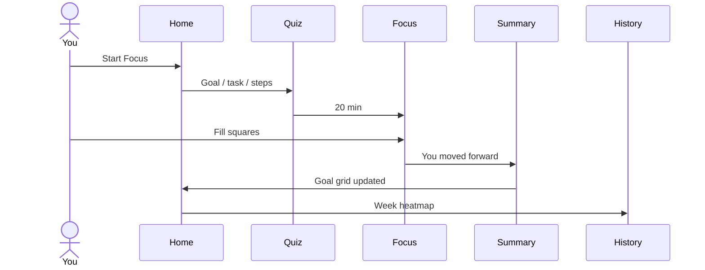

# Squares — focus loop

Anti-procrastination execution layer. Atomic unit is a **square** (one small action). Timer ≠ square.

Notion is import-only (out of this prototype). No guilt streaks. Copy: “You moved forward.”

## Happy path

1. Home — goals as square grids, Start Focus.
2. Quiz — Goal → Task → steps to work on.
3. Focus Mode — 20 min timer; tap squares to fill (0–n per session).
4. Summary — +squares, progress before → after.
5. Home — same goal, more squares filled.
6. History — week chips + 15-min heatmap; Insights from squares.

