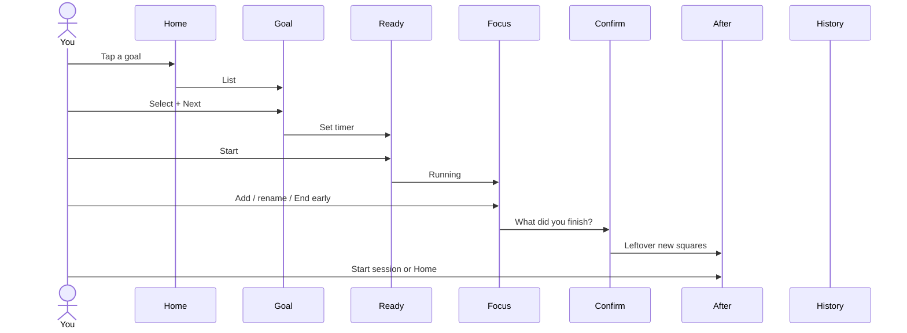

# Squares — focus loop

Anti-procrastination execution layer. Atomic unit is a **square** (one small action).

Notion is import-only (out of this prototype). No guilt streaks. Copy: “You moved forward.”

## Happy path

1. Home — last-7-days GitHub strip; goals; `+` under the list (name modal). Tap a goal.
2. Goal — canned Keep-style list. Checkbox = done. Tap text = this session (full-width highlight). Next.
3. Ready — set timer (presets / ±5). Start.
4. Focus — rename, add squares (this is split). End early or tap timer.
5. Confirm — planned vs added-in-session. Confirm.
6. After — leftover new squares land on the tree. Rearrange, start again, or Home.
7. History — GitHub calendar (one square per day). Tap a day → that day's stats.

