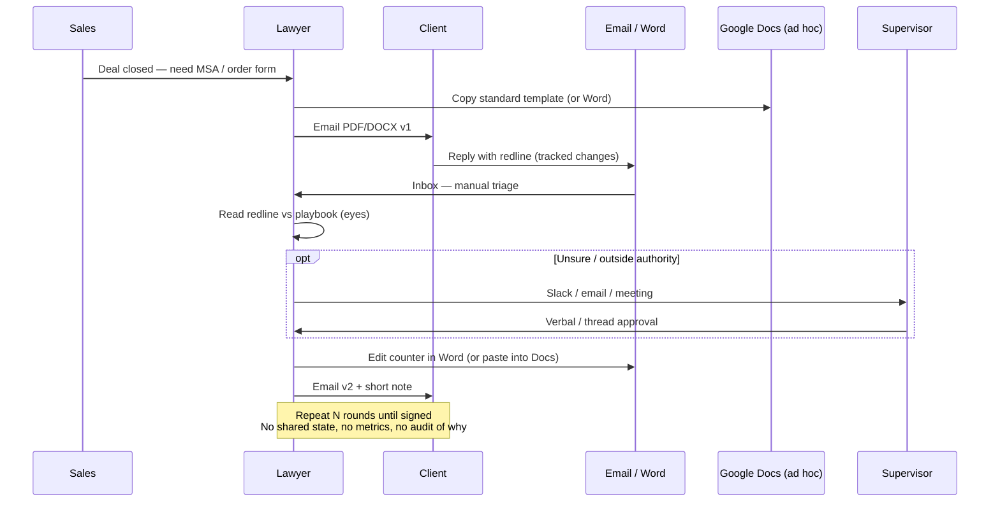

# Client redline — as-is (no system)

How the loop usually runs today after a lead closes, without Legal 360.

## Sequence

## Pain

- Redline vs playbook is manual; decisions inconsistent across lawyers.
- Supervisor approval lives in Slack threads — hard to reconstruct later.
- Client never sees Docs; internal copy often drifts from what was emailed.
- No calendar of open rounds; Sales asks “where is the MSA?” into the void.
- No measure of which positions we concede most.

## What exists

CLM / DocuSign for signature storage after the fact. The **negotiation rounds** are mostly email + Word + human memory.
