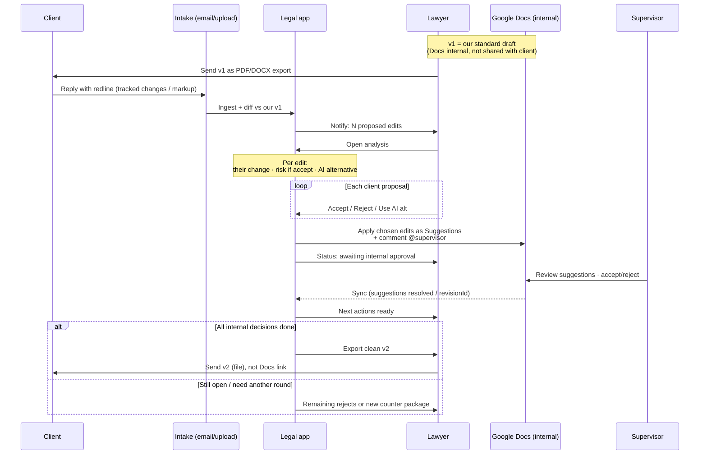

# Client redline review flow

Scope: **client-proposed edits only** — our draft → their redline → lawyer decision → internal Google Docs approval → reply artifact.

Client never gets a Google Docs link. Docs is the internal collaboration / supervisor-approval layer. Client channel = email / exported file.

## Sequence



## Layers

| Layer | Role |
|---|---|
| App | Diff client edits vs our draft, risk, AI alternative, lawyer decisions |
| Google Docs | Internal working copy + Suggest mode + supervisor approve |
| Client channel | File / email only — never share the Docs URL |

## Screen sketch (analysis)

```
Notify
  "Client returned N proposed edits · open →"

Analysis (vs OUR draft v1)
  ┌ # ┬ Their edit (quote) ┬ Risk if accept ┬ AI alt ┬ Action ─┐
  │ 1 │ …                  │ ! / ~ / ✓      │ …      │ Accept │
  │   │                    │                │        │ Reject │
  │   │                    │                │        │ Use AI │
  └─┴──────────────────────┴────────────────┴────────┴────────┘

Push to Docs (internal)
  chosen edits → Suggestions on working copy
  @supervisor · review before we reply to client

After Docs sync
  ✓ suggestions accepted by Sup
  ✗ rejected by Sup → back to app as "need new decision"
  → [Export v2] [Package rejects + counters for client email]
```

## States (for implementation)

`ingested → decided → pending_docs_approval → ready_to_send`

## Notes

- Docs API: write edits with `writeControl.writeMode: SUGGEST`; sync via `revisionId` / suggestion status. Some suggestion-thread APIs are Developer Preview — enough for a demo.
- Hard part: map client Word/PDF anchors onto spans in our Docs draft. Demo can use a small fixed set of edits.
